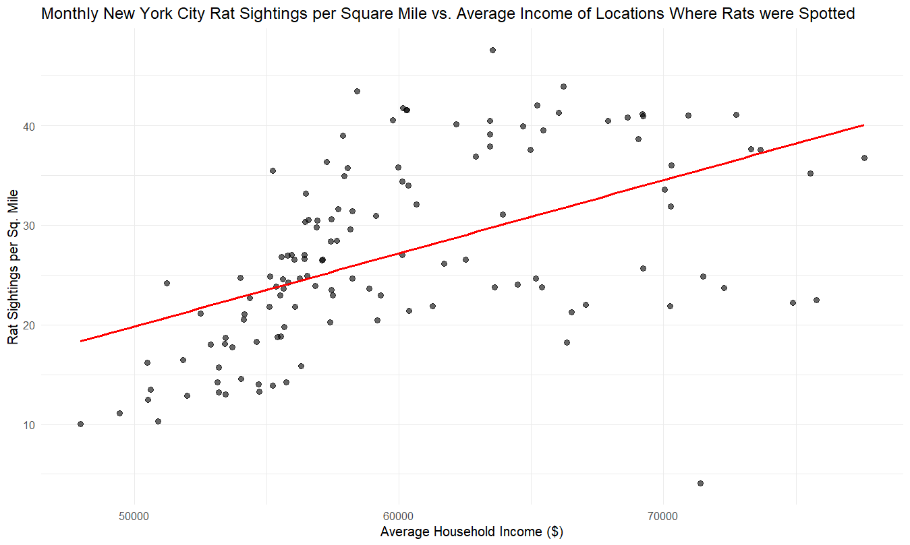

```{r LibraryChunk, echo = FALSE}
knitr::opts_chunk$set(echo = FALSE,
                      fig.align = 'center')
```

```{r setup, include = FALSE}
knitr::opts_chunk$set(echo = FALSE, warning = FALSE, message = FALSE)
```

## **Part 1** 

### **Rat Sightings Analysis**

### **Data Processing & Cleaning**

The dataset was cleaned by standardizing date formats, extracting relevant time-based variables, and filtering out missing borough data to ensure accurate analysis.

```{r}
# Packages that we will be using
library(tidyverse)
library(lubridate)
library(dplyr)
library(ggplot2)

# Data Read
rats_raw <- read_csv("Rat_sightings.csv", na = c("", "NA", "N/A"))
rats_clean <- rats_raw %>%
  rename(created_date = `Created Date`,
         location_type = `Location Type`,
         borough = Borough) %>%
  mutate(created_date = mdy_hms(created_date)) %>%
  mutate(sighting_year = year(created_date),
         sighting_month = month(created_date),
         sighting_day = day(created_date),
         sighting_weekday = wday(created_date, label = TRUE, abbr = FALSE)) %>%
  filter(borough != "Unspecified")
```


```{r}
library(knitr)
library(kableExtra)
rats_summary <- rats_clean %>%
  group_by(borough, sighting_year) %>%
  summarise(sightings = n(), .groups = "drop")
rats_wide <- rats_summary %>%
  pivot_wider(
    id_cols = borough,
    names_from = sighting_year,
    values_from = sightings
  )
rats_wide %>%
  kable(caption = "Rat Sightings by Borough and Year", booktabs = TRUE) %>%
  kable_styling(latex_options = c("striped", "hold_position", "scale_down"),
                full_width = FALSE) %>%
  add_header_above(c(" " = 1, "Year" = ncol(rats_wide) - 1))
```

Our analysis showed that:

- Brooklyn consistently had the highest sightings, maximum in 2017.

- The Bronx and Manhattan showed increasing trends from 2014 to 2017.

- Queens and Staten Island had significantly lower complaints.

- Sightings dropped in 2020, which might be due to COVID-19 pandemic changes.

These trends show that certain boroughs require more targeted pest control strategies.

\newpage

```{r}
rats_summary <- rats_clean %>%
  group_by(borough, sighting_year) %>%
  summarise(sightings = n(), .groups = "drop")
# Heatmap
ggplot(rats_summary, aes(x = sighting_year, y = borough, fill = sightings)) +
  geom_tile(color = "white") +  
  geom_text(aes(label = sightings), color = "black", size = 4) +  
  scale_fill_gradient(low = "white", high = "darkred") + 
  theme_minimal() +
  labs(title = "Heatmap of Rat Sightings in NYC by Borough and Year",
       x = "Year",
       y = "Borough",
       fill = "Sightings") +
  theme(plot.title = element_text(hjust = 0.5, face = "bold", size = 14),
        axis.text.x = element_text(angle = 45, hjust = 1, size = 10),
        axis.text.y = element_text(size = 10),
        legend.title = element_text(size = 10),
        legend.text = element_text(size = 9))
```

The heatmap clearly shows the following:

- Brooklyn and Manhattan have the most rat sightings.

- There were major increases in rat reports during 2015-2017 throughout several boroughs.

- Queens and Staten Island have fewer rat sightings overall.

Based on this, we can say that pest control teams should concentrate their efforts in the boroughs with the highest number of rats, mainly Brooklyn and Manhattan.

\newpage

```{r}
# Line plot
ggplot(rats_summary, aes(x = sighting_year, y = sightings, color = borough)) +
  geom_line(linewidth = 1) +
  geom_point() +
  theme_minimal() +
  labs(title = "Trend of Rat Sightings in NYC (2010-2020)",
       x = "Year",
       y = "Number of Sightings",
       color = "Borough")
```

After doing trend analysis, we can say that:

- Brooklyn had the biggest increase in rat sightings, reaching its highest point in 2017.

- Manhattan and Bronx showed consistent growth in rat numbers over time.

- Rat sightings went down in 2020, probably because of COVID-19 pandemic changes.

This pattern analysis shows we need different rat control plans for each borough, rather than using one approach for the whole city.

\newpage




The scatter plot above shows as average household income of locations of interest go up, there are more rat sitings during that month.

This may seem counterintuitive at first as lower income locations could be expected to have higher quantities of rats, but this could be because a variety of reasons found in higher income locations. One major reason that could explain this result is the fact that higher income regions have more pest control efforts, which could artificially raise the sitings compared to lower income areas. Additionally, higher income areas have more restaurants which can create a food source for rats.

Therefore, this result points to a potential need for increased rat monitoring measures in low income areas and further investigation into whether or not the higher quantity of sightings in high income areas is accurate to their need for rat control methods.

\newpage

## **Policy Recommendations**

### **Recommendations for the Mayor's Office**

Based on the data analysis, we recommend:

1. **Better Trash Management Where Rats Are Common**

   - Collect garbage more often in Brooklyn, Bronx, and Manhattan.
   - Add more trash bins in crowded areas.
   
2. **Tougher Rules for Restaurants & Building Sites**

   - Do more health inspections.
   - Make construction sites use rat control methods.
   
3. **Teaching the Public & Encouraging Reports**

   - Show people why reporting rats on weekends matters.
   - Provide incentive/reward to neighborhoods that stay clean and rat-free.
   
4. **Focused Rat Control Efforts**

   - Increase baiting and killing rats near subways and construction.
   - Schedule more pest control work on Mondays and Tuesdays when complaints peak.

\newpage

## **Part 2** 

### **Data Hunting**

### Following are the different data sources for potential use in our final project:

### **Annual mean wage for All Occupations in All Industries in the United States**

https://data.bls.gov/dataQuery/find?fq=survey:%5Boe%5D&s=popularity:D

The first dataset comes from the US Bureau of Labor and Statistics, and it displays the annual mean wage for all occupations. Some general question s we may be able to answer using this data are what jobs are predicted to increase or decrease in the future? What jobs currently have the highest rate of change of payment? Can we predict what someones wage will be given their occupation? To what degree? How much does the wage vary based on location?  Given demographic indicatiors, we could also check to see if the mean wage varies at all based on certain characteristics. 

### **FBI Crim Reporting Statistics**

https://cde.ucr.cjis.gov/

This dataset comes fro mthe FBI Crime Data Explorere. It shows crime data in specific areas throughout the country over time. With this data, we could answer questions such as what areas experience crime most often? Could we predict where crime is likely to happen next based on past data? Are there specific law or circumstance changes that may have reduced or increased crime in a specific area? Is unemployment related to crime rates? Does higher crime rate effect other variables such as standard of living, house prices, etc? We could do a time series regression on the data to theoretically help predict where to allocate resources.


### **EPA Air Quality Data**

https://aqs.epa.gov/aqsweb/airdata/download_files.html

This dataset comes from the EPA and shows the Air Quality Index per county in the US per year. With this data we can answer general questions such as what areas experience the worst air quality? Are these areas near specific centers of industry or populations? Is better air quality more common at certain times? Can you predict what the air quality will be given certain policies of a county? Is there a relationship between air pollution levels and respiratory issues? At what level do you see a real impact?